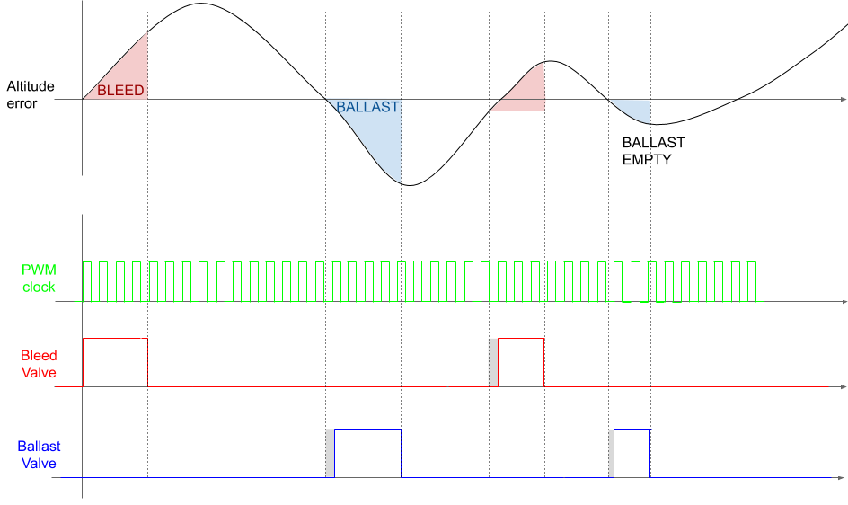

# Altitude Control System

Actively control the weight and buoyancy of the HAB in order to maintain equilibrium at a prescribed altitude for as long as resources allow.

## Approach

Normally the balloon is filled with lifting gas so that it rises with the payload until it reaches an altitude where the ambient temperature and pressure cause the balloon to expand beyond its limits and it bursts. Without active control, flight time can be increased by filling the balloon with just enough lift gas to be at equilibrium at the target altitude, but this is difficult for several reasons:

*   The actual temperature and pressure at the target altitude are at best roughly approximated by models, even when accounting for the latest weather forecast.

*   Temperature and pressure are not constant at the target altitude, so even if there was a perfectly measured amount of lift gas to be at equilibrium for a specific temperature and pressure band, it wouldn’t follow a target altitude.

*   Filling the balloon with less gas would mean it takes longer for the HAB to reach the target altitude.

The HAB’s altitude is a function of two opposing forces: the upward buoyancy force and the weight of the balloon-payload system. Critically, both are directly influenced by something we can control. Buoyancy is a function of the amount of lift gas in the balloon, and weight is a function of the mass of the payload. Thus we can design a closed-loop control algorithm to change the balance of these two forces by bleeding lift gas from the balloon or dropping ballast mass from the payload based on the measured altitude in order to converge to some target altitude. This addresses a number of issues encountered with passive flight:

*   Dynamic feedback control allows the balloon to maintain equilibrium at a target altitude through changing temperatures and pressures.

*   Open-loop control of lifting gas allows the balloon to be overfilled at launch, rising to the target altitude quickly and then bleeding gas from the balloon until equilibrium is achieved.

In order for the controller to converge to a geometric altitude, it must use a non-atmospheric reference like GPS altitude. Barometric altimeters measure pressure, which is calibrated to isobaric layers of a standard reference atmosphere.

**Primary mode:** GPS altitude hold.

**Secondary mode:** Isobaric altitude hold.

# ConOps

1.  Wait for a _controller enable_ to be sent.

    1.  Disarm the controller when the avionics boot up.

    2.  During pre-launch, operators enable the controller.

2.  Disarm the controller unless when all of the following conditions are met:

    1.  A _controller enable_ command has been received since the last boot or the last _controller disable_ command.

    2.  The control error has crossed zero at least once (_i.e._, the HAB’s altitude has risen above the target altitude at least once).

    3.  There is ballast mass remaining in the reservoir.

        1.  Calibrate the mass flow rate at the ballast release valve prior to flight and keep a tally of remaining ballast mass.

    4.  There is enough lifting gas in the balloon for the HAB to rise if the reservoir were empty.

        1.  Use a pressure sensor in the balloon to compute the mass flow rate at the bleed valve from the gauge pressure and temperature of lifting gas inside the balloon and keep a tally of remaining lifting gas.

3.  Use a tuned PI control to drive a ballast release valve and a gas bleed valve. The controller is designed for disturbance rejection of a noisy altitude signal.

    
    1.  In order to conserve control effort, we must tune the controller such that overshoot and oscillations are minimized.

    2.  Response time and settling time should be tuned to be small compared to flight time, but can still be on the order of ~1 hour.

    3.  Control loop PWM frequency is tuned to be much faster than the response time.

4.  Enter _stabilize_ control mode when the controller is armed and remain in this mode until ascent rate and/or altitude error are greater than the allowable bounds.

    1.  **GPS altitude hold (Stabilize)**

        1.  Use GPS altitude to converge to a geometric altitude that may cross isobaric layer boundaries.

        2.  This control mode uses more control mass than _barometric altitude hold_ so it should not be used for extended periods of time.

        3.  Use this control mode during the _stabilize_ phase to quickly approach the target altitude.

        4.  If the GPS module cannot obtain a solid lock, fall back to barometric altitude for this phase.

5.  Once the vehicle is near the target altitude and has reached a steady state, transition to _cruise_ mode to maintain an altitude near the target for an extended period of time.

    1.  **Barometric altitude hold (Cruise)**

        1.  Use barometric altitude to equalize to an isobaric layer of the atmosphere corresponding to a calibrated approximate altitude.

        2.  This control mode uses less control mass because it is able to equalize the balloon pressure to ambient pressure and “ride” isobaric layers of atmosphere.

        3.  Hold an isobaric altitude during the _cruise_ phase in order to conserve control mass.

6.  If the controller is still armed and the altitude error exceeds the allowable range, transition from _cruise_ to _stabilize_ and then repeat this algorithm until the controller is disarmed.

7.  When the controller is disarmed, dump all remaining ballast.

    1.  Lock the ballast valve in the open position.

    2.  Lock the bleed valve in the closed position.

**To Do:** Describe in greater detail the “lockout” conditions, how delay criteria work (do not act until accumulated steady state error is above threshold), how actuation commands are structured (PWM with actuation duration, where 0 or -1 duration means do nothing)

# PID Control

In order to dynamically determine how much to bleed or ballast, we implement a PID controller to determine the percentage of time of each control cycle to keep the bleed or ballast valve open. This is also referred to as PWM control with a PID algorithm.

The PID control algorithm works by modulating the inputs, _u_, to the _Plant_, which in our case means the bleed and ballast controls. The Plant is the physical response, so the balance of weight, buoyancy, and drag forces with the given mass properties and ambient conditions. (See [https://brickworks.atlassian.net/wiki/spaces/HT/pages/63799297/Simple+Atmospheric+Flight+Model#Sum-of-Forces-%2F-Net-Force](https://brickworks.atlassian.net/wiki/spaces/HT/pages/63799297/Simple+Atmospheric+Flight+Model#Sum-of-Forces-%2F-Net-Force)) The output of the Plant is the actual altitude, _y_. For a given set point altitude, _r_, the PID controller attempts to reduce the error, _e=r-y_, to zero.

The PID controller consists of a set of gains applied to a proportional term, an integral term, and a derivative term that all operate on the error signal, _e_. These gains are tuned to get the desired response from the controller.

**Rules of thumb**

*   **Proportional gain**: How aggressively signal approaches setpoint. Too much causes overshoot. No impact on steady-state error.

*   **Integral gain**: How much error matters over time. Reduces oscillations and steady-state errors. Prone to _windup_, where accumulated errors over a long time cause lag in the controller after it reaches the desired point.

*   **Derivative gain**: How much rate of change matters. Reduces overshoot. Prone to oscillations. Noisy signals make it go crazy, but this can be mitigated by adding a lowpass filter.

**References**

*   [BYU Dynamics and Control by John D. Hedengren](http://apmonitor.com/pdc/index.php/Main/ProportionalIntegralControl)

*   [Control Tutorials for Matlab & Simulink](http://ctms.engin.umich.edu/CTMS/index.php?example=Introduction&section=ControlPID)

*   [PID Control Design by A.B. Campo](https://www.intechopen.com/books/matlab-a-fundamental-tool-for-scientific-computing-and-engineering-applications-volume-1/pid-control-design)

*   [Wikipedia - PID Controller](https://en.wikipedia.org/wiki/PID_controller), [Wikipedia - Integral Windup](https://en.wikipedia.org/wiki/Integral_windup)

*   [The Basics of Tuning PID Loops](https://www.crossco.com/blog/basics-tuning-pid-loops/)

## Tunable Parameters

To achieve the desired behavior from the controller, we tune some of the parameters in software and tune other parameters as part of choosing or sizing elements of the system during the design process.

### Pure Tunables

I call the parameters that we can choose and change “for free” _pure tunables_, since tuning these values can be done as desired without extra engineering work.

*   Target altitude

*   Controller dead zone (allowable steady state error)

*   Control loop cycle time (compute)

*   Control loop cycle time (actuation PWM)

*   Sensor measurement sample time

*   Lowpass filter gain

*   PID controller gains (which determine response time and percent overshoot)

*   Initial ballast mass

*   Initial lift gas mass

*   Lift gas reserve fraction (fraction of total mass of lift gas allocated for altitude control)

*   Arm / disarm criteria

### Calibrated Tunables

_Calibrated tunables_ are what I call parameters that affect the controller’s behavior or system response but can’t be dialed in on a whim. These are things that require extra engineering or design changes to tune. We choose ideal values for these parameters during the design process, and then we measure the true values when the system is built.

*   Ballast mass flow rate

*   Bleed mass flow rate

*   Actuator and component dry mass

*   Maximum control loop cycle time (compute)

*   Maximum control loop cycle time (actuation PWM)

*   Maximum sensor measurement sample time

*   Maximum lift gas reserve fraction

# Avionics

The altitude control flight software application ([https://brickworks.atlassian.net/wiki/spaces/NUCLEUS/pages/106692609/Main+Flight+Computer+Software+Design#Altitude-Controller](https://brickworks.atlassian.net/wiki/spaces/NUCLEUS/pages/106692609/Main+Flight+Computer+Software+Design#Altitude-Controller)) issues commands to open the ballast or bleed valves over the CAN bus. When a _bleed_ or _ballast_ command is received by the altitude control interface board ([Altitude Control/Dynamics Sensor Card](https://brickworks.atlassian.net/wiki/spaces/NUCLEUS/pages/142803082)) over CAN, it executes the corresponding subroutine to carry out the command. The software environment onboard the altitude control interface board ([Altitude Control/Dynamics Card Software Design](https://brickworks.atlassian.net/wiki/spaces/NUCLEUS/pages/143425623)) includes drivers for the hardware interfaces, such as a PWM motor controller for the valve actuators.

The altitude control interface board is also responsible for polling sensors and actuators for telemetry and pre-processing the raw signals (_e.g._ voltages from a pressure sensor) into the appropriate derived values (_e.g._ values in units of pressure) before sending them to the CAN bus for use by other flight software and downlink.

## Hardware

[Altitude Control/Dynamics Sensor Card](https://brickworks.atlassian.net/wiki/spaces/NUCLEUS/pages/142803082)

**Sensing**

*   GPS (altitude)

    *   Location?

*   Barometric altimeter

    *   Location?

*   Valve actuator position/state

    *   Balloon valve sensor: [Balloon Board](https://brickworks.atlassian.net/wiki/spaces/NUCLEUS/pages/142803089/Balloon+Board)

*   (Optional) Ambient and balloon internal pressures

    *   Balloon pressure: [Balloon Board](https://brickworks.atlassian.net/wiki/spaces/NUCLEUS/pages/142803089/Balloon+Board)

    *   Ambient pressure: [Avionics Sensor Card](https://brickworks.atlassian.net/wiki/spaces/NUCLEUS/pages/142376970/Avionics+Sensor+Card)

**Actuation**

*   Ballast: See [Ballast Hopper](https://brickworks.atlassian.net/wiki/spaces/NUCLEUS/pages/130121740/Ballast+Hopper)

*   Bleed: See [Balloon Plug](https://brickworks.atlassian.net/wiki/spaces/NUCLEUS/pages/129957889/Balloon+Plug)

# System Design Parameters

## Requirements

|**Requirement**|**Description**|**Target**|**Allowable Bounds**|
|--- |--- |--- |--- |
|Settling time|Time for controller to transition from _stabilize_ mode to _cruise_ mode.|20 minutes|10 minutes - 1 hour|
|Steady state error (dead zone)|Magnitude of the difference between target altitude and actual altitude during _cruise_ mode.|150 m|0 m - 500 m|
|Ballast mass budget|Portion of total system mass budget allocated to ballast material.|1 kg or 25%|1 kg - 2 kg|
|Bleed mass budget|Portion of total system lift gas allocated to altitude control.|0.5 kg or 30%|no more than the mass of lift gas needed for positive lift with empty ballast|
|Flight duration|Impact on total flight time (_launch_ to _recovery_) compared to an equivalent flight with altitude control disabled.|+3 hours|no less than the modeled flight duration with controller disabled (upper bound constrained by geofencing and weather)|

## System Elements

|**Configuration Item**|**Function**|**Location**|**Interfaces**|
|--- |--- |--- |--- |
|Altitude control application|Executes control algorithm and issues commands to actuators.|[https://brickworks.atlassian.net/wiki/spaces/NUCLEUS/pages/106692609/Main+Flight+Computer+Software+Design#Altitude-Controller](https://brickworks.atlassian.net/wiki/spaces/NUCLEUS/pages/106692609/Main+Flight+Computer+Software+Design#Altitude-Controller)|*   [Main Flight Computer Software Design](https://brickworks.atlassian.net/wiki/spaces/NUCLEUS/pages/106692609/Main+Flight+Computer+Software+Design)

*   [Telemetry RX App Design](https://brickworks.atlassian.net/wiki/spaces/NUCLEUS/pages/108789807/Telemetry+RX+App+Design)

*   Command Stream|
|[Altitude Control/Dynamics Sensor Card](https://brickworks.atlassian.net/wiki/spaces/NUCLEUS/pages/142803082)|Receives commands, drives bleed and ballast actuators, collects and preprocesses signals from sensors and reports telemetry to the CAN bus. ([Altitude Control/Dynamics Card Software Design](https://brickworks.atlassian.net/wiki/spaces/NUCLEUS/pages/143425623))|[Avionics Rack](https://brickworks.atlassian.net/wiki/spaces/NUCLEUS/pages/131465217/Avionics+Rack)|*   [Avionics Rack](https://brickworks.atlassian.net/wiki/spaces/NUCLEUS/pages/131465217/Avionics+Rack)

*   [Backplane Interface Board](https://brickworks.atlassian.net/wiki/spaces/NUCLEUS/pages/142278842/Backplane+Interface+Board)

*   CAN bus|
|Ballast valve actuator|Dispenses ballast mass.|[Ballast Hopper](https://brickworks.atlassian.net/wiki/spaces/NUCLEUS/pages/130121740/Ballast+Hopper)|*   [Ballast Hopper](https://brickworks.atlassian.net/wiki/spaces/NUCLEUS/pages/130121740/Ballast+Hopper)

*   [Altitude Control/Dynamics Sensor Card](https://brickworks.atlassian.net/wiki/spaces/NUCLEUS/pages/142803082)|
|Bleed valve actuator|Dispenses lift gas.|[Balloon Plug](https://brickworks.atlassian.net/wiki/spaces/NUCLEUS/pages/129957889/Balloon+Plug)|*   [Balloon Plug](https://brickworks.atlassian.net/wiki/spaces/NUCLEUS/pages/129957889/Balloon+Plug)

*   [Altitude Control/Dynamics Sensor Card](https://brickworks.atlassian.net/wiki/spaces/NUCLEUS/pages/142803082)|
|Barometric altimeter|Measures barometric altitude.|[Avionics Sensor Card](https://brickworks.atlassian.net/wiki/spaces/NUCLEUS/pages/142376970/Avionics+Sensor+Card)|*   Payload structural bus|
|GPS (altitude)|Measures altitude using GPS.|[Avionics Sensor Card](https://brickworks.atlassian.net/wiki/spaces/NUCLEUS/pages/142376970/Avionics+Sensor+Card)|*   Payload structural bus|

# Risk assessment

|**Risk**|**Likelihood**|**Impact**|**Mitigation**|
|--- |--- |--- |--- |
|Controller bleeds too much gas so that the remaining gas in the balloon cannot lift the payload, even with an empty ballast hopper.||SEVERE

Flight terminated early.|*   Calibrate the bleed valve mass flow rate (perhaps in correlation to balloon internal pressure and/or time spent with valve open) and place a software disarm based on estimated gas remaining.|
|Altitude never converges to a stable altitude by the time actuation limits are reached.||MINOR

No impact on other aspects of the flight.|*   Tune the controller to minimize overshoot and oscillations, allowing for a longer response time.|
|Bleed valve releases more gas than it thinks it did.||MODERATE

It’s okay if more gas is released than expected unless the remaining gas in the system cannot lift the dry mass of an empty vehicle.|*   Add some margin to the lift gas reserve level so that the controller disarms due to low gas before reaching a dangerously low level.

*   Make a direct measurement from inside the balloon correlated to the amount of gas remaining, such as a calibrated temperature and pressure corresponded to gas remaining.|
|Bleed valve gets stuck open.||SEVERE

Flight terminated early.|*   Redundant valve close mechanism?

*   Build a cutdown threshold altitude into the controller. If the altitude controller is armed and altitude reaches the lower bound, issue a cutdown command. (If a target alt was 80k ft with allowable error of +/- 500m, issue a cutdown at 60k ft.|
|Bleed valve gets stuck closed.||MINOR

Altitude control is critically disabled. No impact on other aspects of the flight.|*   Testing and pre-flight inspection.|
|Ballast valve gets stuck open.||MINOR

Altitude control is critically disabled. No impact on other aspects of the flight.|*   Testing and pre-flight inspection.|
|Ballast valve gets stuck closed.||MODERATE

If ballast is stuck closed and the vehicle is descending, this would terminate the flight as the vehicle would not be able to recover positive lift.|*   Redundant valve open mechanism?

*   Emergency dumping of all ballast?|
|Controller is armed too early.||MODERATE

Bleed and ballast reserves could be expended prior to reaching the target altitude.|*   Place conservative delays and lockouts on the arming criteria.|

# Proof of Concept

## Simulink

Uses an implementation of [Simple Atmospheric Flight Model](https://brickworks.atlassian.net/wiki/spaces/HT/pages/63799297/Simple+Atmospheric+Flight+Model) in MATLAB+Simulink

