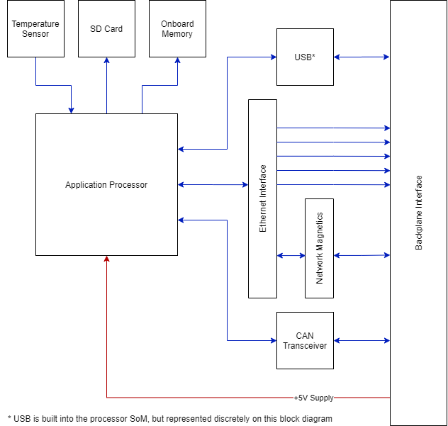
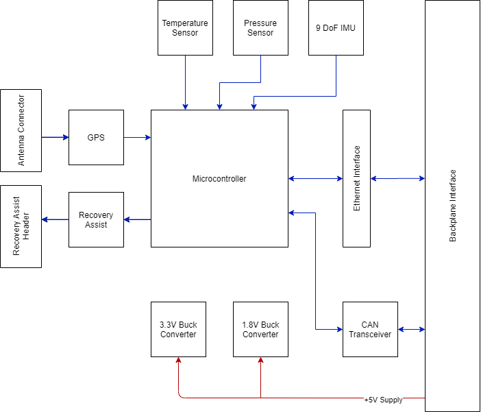
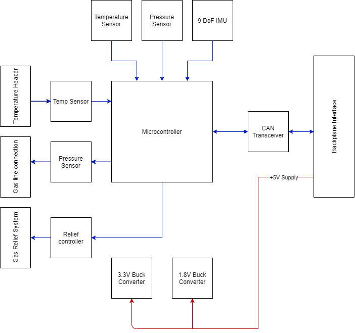
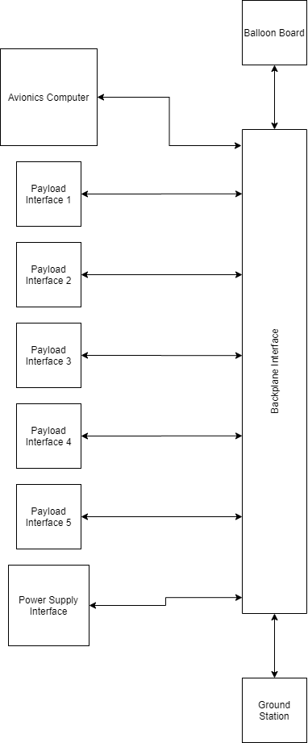
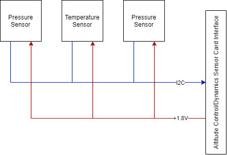

# Flight Avionics Hardware
!!! danger "Work in progress"
    This page contains information that may be incorrect or out of date. Check [Confluence](https://brickworks.atlassian.net/wiki/spaces/NUCLEUS/overview) for the latest project information.

### List of currently in development boards:

*   [Main Flight Computer Card](https://brickworks.atlassian.net/wiki/spaces/NUCLEUS/pages/140705870/Main+Flight+Computer+Card)
*   [Avionics Sensor Card](https://brickworks.atlassian.net/wiki/spaces/NUCLEUS/pages/142376970/Avionics+Sensor+Card)
*   [Altitude Control/Dynamics Sensor Card](https://brickworks.atlassian.net/wiki/spaces/NUCLEUS/pages/142803082)
*   [Communications Card](https://brickworks.atlassian.net/wiki/spaces/NUCLEUS/pages/141000910/Communications+Card)
*   [Power Supply Card](https://brickworks.atlassian.net/wiki/spaces/NUCLEUS/pages/142376981/Power+Supply+Card)
*   [Backplane Interface Board](https://brickworks.atlassian.net/wiki/spaces/NUCLEUS/pages/142278842/Backplane+Interface+Board)
*   [Balloon Board](https://brickworks.atlassian.net/wiki/spaces/NUCLEUS/pages/142803089/Balloon+Board)
*   [Design Info](https://brickworks.atlassian.net/wiki/spaces/NUCLEUS/pages/223281153/Design+Info)
*   [Hardware Design Notebook](https://brickworks.atlassian.net/wiki/spaces/NUCLEUS/pages/240025601/Hardware+Design+Notebook)

### List of future payload boards:

*   Imaging Card

### General Payload Hardware Description

For Brickworks first HAB launch, the electronics payload architecture consists of eight distinct PCBs. a Backplane Interface provides data and power between all payload cards, balloon board and ground interface. The current payload consists of an Avionics Control Card, Avionics Sensor Card, Altitude Control/Dynamics Sensor Card, Communications Card and Power Supply Card. There is also a Balloon Board attached to the balloon neck. The backplane interface is in the form of a 2mm pitch header style connectors across the backplane for the avionics card, a Molex microfit connector for the balloon board and ethernet port for the ground interface.

Each card is designed such that the blackplane connector is the rear of the card and provides all the avionics interfaces. There will also be additional input/output connections on the front of the card to provide additional sensor and control interfaces that are too low level for the backplane interface.

### Individual Board Description

#### Main Flight Computer Card

This board acts as the brain of the overall payload, containing an application processor level compute card/SoM allowing for the avionics software to run in a Linux environment. All payload control loops and main software systems live on this card. There are two separate data interfaces implemented on this board, all connecting to the other boards through the backplane. An Ethernet switch, acting as high level data and control communications and a CAN bus interface, acting as low level telemetry and status communications. The board accepts a +5V and power rail and locally regulates +1.8V and +3.3V from the +5V rail through the Raspberry Pi. The board is connected to the backplane interface in Slot A and always slot A due to the output pin requirements of this card.

#### Avionics Sensor Card

This microcontroller based board abstracts the “generic” sensors and interfaces used by the avionics control board on all flights. Contains an IMU, pressure sensor and temperature sensor as well as GPS. There is also a “recovery assist” package that will drive a buzzer and LEDs for assisting recovery. An Ethernet and CAN bus interface is provided through connection to the backplane, as well as a common GPIO and three distinct GPIO connections. The board accepts a +5V and power rail and locally regulates +1.8V and +3.3V from the +5V rail.

#### Power Supply Card

This microcontroller based board is the main power supply for the overall payload. Connects to a 4SnP lithium ion battery pack and contains charging, monitoring and balancing circuitry related to said battery pack. There are two main regulators providing power from the battery pack to the rest of the payload, a 5V+ “logic” power rail and a 12V+ “controller” power rail. Microcontroller based collection of telemetry such as battery State of Charge, 5V+/12V+ voltage and current information and temperature is transmitted over CAN back to the avionics board.

#### Communications Card

BLOCK DIAGRAM

This microcontroller based(?) board contains the radios used to communicate back to the ground station. A LimeSDR is the primary control of the RF portion of the board and communicates back to the main flight computer using USB. The board accepts a +5V and power rail and locally regulates +1.8V and +3.3V from the +5V rail.

#### Altitude/Dynamics Control Card

This board is a microcontroller based board that contains both the mechanisms used to maintain a specific altitude during the payload’s mission as well as the sensors used for developing a dynamic model of the payload during flight. Contains the altitude control IMU and pressure sensor as well as ballast release system and sensor nodes for the dynamics system. An Ethernet and CAN bus interface is provided through connection to the backplane, as well as a common GPIO and three distinct GPIO connections. The board accepts both a +5V and +12V power rail and locally regulates +1.8V and +3.3V from the +5V rail.

#### Balloon Board

The board is attached to the balloon neck and contains an IMU used for Dynamics, pressure and temperature sensor for balloon monitoring and control systems used for altitude control helium release. The board has a cable harness connection back to the backplane that contains a CAN bus interface as well as three distinct GPIO and one common GPIO connection. The board accepts a +5V and power rail and locally regulates +1.8V and +3.3V from the +5V rail.

#### Backplane Interface Board

This board is a passive backplane that provides all data and power interfaces used between the different payload cards. The backplane is keyed in a way such that the Avionics Control Card is always in slot “A” due to pinout configurations and the Power Supply Card is always in slot “G” for similar reasons. All other payload cards can be installed in any of the remaining interfaces. Provided interfaces include CAN bus and Ethernet as well as a +5V and +12V power rails to each card. There is also a common GPIO connection to all Cards as well as three distinct GPIO connections to each Card. Separate from the standard Card interfaces are the balloon board interface and the ground interface. The balloon board interface is a JST style connection used only for the balloon control and the ground interface is an INSERT HERE style interface used only for communicating with the ground station/strongbrick.

#### Dynamics Sensor Board

This board is a separate sensor board containing an IMU and pressure sensor used for the dynamics modeling payload. It is located at specific positions within the HAB and interfaces with the Altitude Control/Dynamics Sensor Card through a cable harness. Board cable harness contains an I2C interface and +1.8V voltage rail. These boards will connect to the “Sensor Node” inputs on the Attitude Control/Dynamics Sensor Card.
