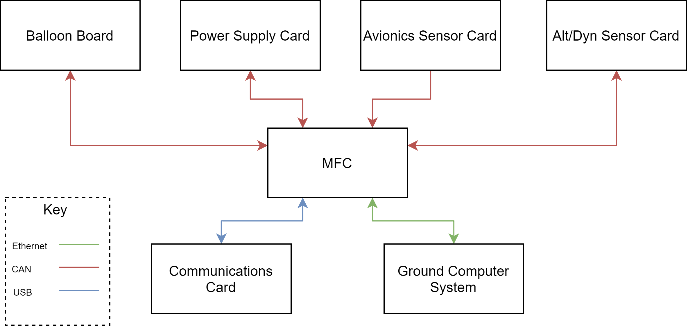

# PDR
**Overview**: 
## Table of Contents
- [Flight Avionics Software](#flight-avionics-software)

---
## Flight Avionics Software

Lead: Austin Bodzas

**Overview**: The scope of this PDR covers all software running onboard the HAB. The flight software contains all of the instructions for capturing data, logging data, actuating the servos, controlling comms and commanding cut-down.

Above is the system level interface diagram for the HAB's Flight Software board level components.  The PDR will detail software executing on the Ballon Board, Power Supply Card, Avionics Sensor Card, and Main Flight Computer (MFC).  The Communications card does not require custom new software, and the Ground Computer System

### Main Flight Computer
#### Overview
The Main Flight Computer software is all software that runs on the Main Flight Computer (sometimes referenced as the processor on the main avionics board).   At a high level, it is this software that serves as the main brain on the HAB.  

#### Interfaces
- CAN: IO board telemetry and commands
- Ethernet: Ground telemetry and commands, SSH
- USB: Connection to SDR for telemetry and commands

#### Responsibilities
* Handling commands from the ground
* Telemetering out mission data
* Logging mission data
* Receiving data from IO boards
* Sending commands to IO boards
* Running control application(s)
* Monitoring health of the system
#### Runtime Environment
Since we are running on the same processor as a beaglebone, we can use RT Linux (PREEMPT_RT). Great, this gives us a great environment to develop applications in.  We can ssh easily into the boards, have a file system, and it’s widely used. Applications are unique binaries, so we can test a flight binary control application in isolation against a plant model.

At the time of writing I am decently unfamiliar with actually writing applications for RT linux.  My understanding is that an application needs to be written within a pthread, so languages like C/C++ are safe.  I’m sure upon further investigation we can see if other languages like Rust allow for easy pthread creation.

**IPC**: For communication between applications, Unix socket datagrams will be used.  As of PDR, this has not been flushed out further.  How these sockets are managed, the datagram format, and the communication model (PubSub) has not been chosen.

#### Applications
##### Altitude Controller
This is a payload application that runs a control loop for maintaining the HAB’s altitude.  This application will consume sensor data from the Altitude Control IO card to feed the control loop.  Commands will then be produced and sent out back to the Altitude Control IO card.
##### System Monitor
Analyzing health of the full craft and the MFC.

* Tracks tx/rx counters for CAN bus messages between MFC and other cards
* Tracks resource utilization
* Performs geofencing checks, informs System Manager (belongs as it’s monitoring it’s situation) 
* Determines remaining helium (if not in control app?), useful to report to ground
* Determines world time using GPS data

##### System Manager
The boss of HAB that dictates the state and actions of the HAB bus to support payloads.  (Note: commanding of payload actuators are left up to payload control applications). 

* Manages the power board (sending commands to do whatever it does)
* Manages/Dictates the “state” of the flight → ties into apps changing tlm frequencies and such? 
* Responds to ground commands
* Commands cutdown of balloon
* Arms/disarms the HAB (dictating that commands to actuators won’t be sent out or acted upon)

##### Logger 
Logs data to non-volatile persistent memory for post-flight consumption.

* Logs avionics system status data (battery data, IO metrics, # of faults, flight state, time of flight, ascent rate)
* Logs payload data 
    * altitude control (ascent rate, time since active, predicted correction value {helium}, valve open time, predicted correction value {ballast}, time ballast cap open)
    * dynamics data (3 IMUs, 4 pressure sensors, Loadcell, timestamp for each data point, altitude for each datapoint, GPS for each datapoint)
* Logs avionics sensor data (sensors on the avionics sensor card such as: GPS, altitude/pressure, temperature, IMU)
* Future Scope: Dynamically change data logging rates depending on the HAB flight state 
##### CAN TLM RX
* Handle processing of incoming CAN messages
* Publish data to IPC 
* Monitor and report RX metrics
##### CAN TLM TX 
* Ingest data from IPC
* Format and transmit CAN messages to their destination
##### ETH TLM RX
* Handle the processing of incoming network packets
* Publish data to IPC
* Monitor and report RX matrix
##### ETH TLM TX
* Ingest data from IPC
* Format and transmit network messages to their destinations
##### GNU Radio App
* Ingest data from IPC to transmit over USB to the SDR
* Post data from SDR received by USB to the IPC
---
