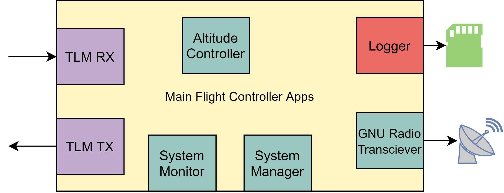

# PDR
**Overview**: 
## Table of Contents
- [Flight Avionics Software](#flight-avionics-software)

---
## Flight Avionics Software

Lead: Austin Bodzas

Jump to:

* [Main Flight Computer](#main-flight-computer-software-design)
* [Avionics Sensor Card](#avionics-sensor-card-software-design)
* [Balloon Board](#balloon-board-software-design)
* [Altitude Control/Dynamics Card](#altitude-controldynamics-card-software-design)
* [Power Board](#power-board-software-design)
* [Verification Plans](#verification-plans)
* [Risk Assessment](#risk-assessment)
* [Cost](#avionics-software-development-cost)

**Overview**: The scope of this PDR covers all software running onboard the HAB. The flight software contains all of the instructions for capturing data, logging data, actuating the servos, controlling comms and commanding cut-down.

Above is the system level interface diagram for the HAB's Flight Software board level components.  The PDR will detail software executing on the Ballon Board, Power Supply Card, Avionics Sensor Card, and Main Flight Computer (MFC).  The Communications card does not require custom new software, and the Ground Computer System

### Main Flight Computer Software Design
#### Overview
The Main Flight Computer software is all software that runs on the Main Flight Computer (sometimes referenced as the processor on the main avionics board).   At a high level, it is this software that serves as the main brain on the HAB.  

#### Interfaces
- CAN: IO board telemetry and commands
- Ethernet: Ground telemetry and commands, SSH
- USB: Connection to SDR for telemetry and commands

#### Responsibilities
* Handling commands from the ground
* Telemetering out mission data
* Logging mission data
* Receiving data from IO boards
* Sending commands to IO boards
* Running control application(s)
* Monitoring health of the system
#### Runtime Environment
Since we are running on the same processor as a beaglebone, we can use RT Linux (PREEMPT_RT). Great, this gives us a great environment to develop applications in.  We can ssh easily into the boards, have a file system, and it’s widely used. Applications are unique binaries, so we can test a flight binary control application in isolation against a plant model.

At the time of writing I am decently unfamiliar with actually writing applications for RT linux.  My understanding is that an application needs to be written within a pthread, so languages like C/C++ are safe.  I’m sure upon further investigation we can see if other languages like Rust allow for easy pthread creation.

**IPC**: For communication between applications, Unix socket datagrams will be used.  As of PDR, this has not been flushed out further.  How these sockets are managed, the datagram format, and the communication model (PubSub) has not been chosen.

#### Applications
##### Altitude Controller
This is a payload application that runs a control loop for maintaining the HAB’s altitude.  This application will consume sensor data from the Altitude Control IO card to feed the control loop.  Commands will then be produced and sent out back to the Altitude Control IO card.
##### System Monitor
Analyzing health of the full craft and the MFC.

* Tracks tx/rx counters for CAN bus messages between MFC and other cards
* Tracks resource utilization
* Performs geofencing checks, informs System Manager (belongs as it’s monitoring it’s situation) 
* Determines remaining helium (if not in control app?), useful to report to ground
* Determines world time using GPS data

##### System Manager
The boss of HAB that dictates the state and actions of the HAB bus to support payloads.  (Note: commanding of payload actuators are left up to payload control applications). 

* Manages the power board (sending commands to do whatever it does)
* Manages/Dictates the “state” of the flight → ties into apps changing tlm frequencies and such? 
* Responds to ground commands
* Commands cutdown of balloon
* Arms/disarms the HAB (dictating that commands to actuators won’t be sent out or acted upon)

##### Logger 
Logs data to non-volatile persistent memory for post-flight consumption.

* Logs avionics system status data (battery data, IO metrics, # of faults, flight state, time of flight, ascent rate)
* Logs payload data 
    * altitude control (ascent rate, time since active, predicted correction value {helium}, valve open time, predicted correction value {ballast}, time ballast cap open)
    * dynamics data (3 IMUs, 4 pressure sensors, Loadcell, timestamp for each data point, altitude for each datapoint, GPS for each datapoint)
* Logs avionics sensor data (sensors on the avionics sensor card such as: GPS, altitude/pressure, temperature, IMU)
* Future Scope: Dynamically change data logging rates depending on the HAB flight state 
##### CAN TLM RX
* Handle processing of incoming CAN messages
* Publish data to IPC 
* Monitor and report RX metrics
##### CAN TLM TX 
* Ingest data from IPC
* Format and transmit CAN messages to their destination
##### ETH TLM RX
* Handle the processing of incoming network packets
* Publish data to IPC
* Monitor and report RX matrix
##### ETH TLM TX
* Ingest data from IPC
* Format and transmit network messages to their destinations
##### GNU Radio App
* Ingest data from IPC to transmit over USB to the SDR
* Post data from SDR received by USB to the IPC

### Avionics Sensor Card Software Design
#### Overview
The Avionics Sensor Card software is all software that runs on the Avionics Sensor Card MCU .   At a high level, the software on this card streams down generic sensor telemetry to the MFC.

#### Interfaces
* CAN: Telemetry and Commands with the MFC
* I2C/SPI: Reading from sensors

#### Responsibilities
* Send IMU, GPS, Temperature, and Pressure sensor data to the MFC
* Drive the Recovery assist system

#### Runtime Environment

**Bare Metal** 
 The tasks performed by this card are so simple.  A simple while loop hooked up to a simple block on a periodic clock should suffice. 

### Balloon Board Software Design
#### Overview
The Balloon Board software is all software that runs on the Balloon Board MCU .  The Balloon Board software 's primary tasks are streaming down Balloon sensor data, and acting upon commands for the relief controller.

#### Interfaces
* CAN: Telemetry and Commands with the MFC
* I2C/SPI: Reading from sensors
* PWM: Commanding actuators

#### Responsibilities
* Read IMU, Temperature, and Pressure sensor data from peripherals, transform to usable units, and telemeter to the MFC
* Drive the gas relief system in response to commands from the MFC
* Perform Cut Down in response to commands from the MFC

#### Runtime Environment

**Bare Metal** 
 The tasks performed by this card are so simple.  A simple while loop hooked up to a simple block on a periodic clock should suffice. 

#### Design

The Balloon board needs to receive commands from the MFC in order to command the servo valve on the balloon.

**Arm Command**: The software loop sets the arm flag to the boolean value received from the MFC. The arm flag will be boolean, with true indicating that the servo valve power should be activated.  A value of true will result in a GPIO line being held high to command a MOSFET to connect power to the servo valves.  False will result in holding this GPIO line low.

**Valve Command** - This command is received as a percentage.  This percentage is interpreted by the balloon board as the duration percentage of a [5] second duty cycle that the valve should be fully open.  Only the last command is accepted per duty cycle, and acted upon for the next cycle. All other subsequent packets are discarded.

### Altitude Control/Dynamics Card Software Design
#### Overview
The Altitude Control/Dynamics Card Software reports sensors relevant to these payloads, along with commanding the ballast actuator. This board software-wise looks near identical to the balloon board in design.  It abstractly has sensors, actuators.  It reports telemetry from these sensors, and acts upon MFC commands to drive actuators.  Refer to the [Ballon Board section](#balloon-board-software-design) for more information.

#### Interfaces
* CAN: MFC commands/telemetry
* I2C/SPI: Sensors
* PWM: Ballast Actuator

#### Responsibilities
* Report Sensor data to MFC
* Drive the Ballast Actuator in response to commands from the MFC
* Maintain a safe state per commands from the MFC

#### Environment
**Bare Metal** 
 The tasks performed by this card are so simple.  A simple while loop hooked up to a simple block on a periodic clock should suffice. 

###  Power Board Software Design
#### Overview
The power boards main job is to provide smooth regulated power to the rest of the HAB across 2 rails, 5V and 12V. The power board is also tasked with monitoring the conditions of said rails, and reporting the voltage and current draw from each to the main fight computer. The final task attributed to the power board is battery management. The board is in charge of charging, and monitoring the voltage in the batteries.

#### Interfaces
* CAN: MFC commands/telemetry
* I2C: BQ76920 (Battery monitor)
* I2C: LTC4015 (Charger Controller)

#### Responsibilities
* Configure BQ76920 to the minimum allowable voltage upon initialization
* Configure BQ76920 to maximum allowable voltage upon initialization
* Configure BQ76920 to overcurrent value
* Read individual cell voltages from BQ76920, report pack voltage to MFC
* Read pack temperature from BQ76920, report to MFC
* Configure charger temperature LTC4015 with input current upon initialization
* Report charger temperature from LTC4015 to the MFC
* Read coulomb count from LTC4015, and report to MFC
* Report low battery flag when low on battery based off coulomb count to the MFC**
* Report voltages of 5V and 12V rails to the MFC
* Report currents of 5V and 12V rails to the MFC
* Report board [thermistor] temperature reading to MFC

#### Environment
**Bare Metal**:
The tasks performed by this card are simple. A simple while loop blocking on a periodic clock should suffice.  Some hardware configuration needs to occur during an initialization period.

## Verification Plans
The software verification strategy will be pretty low on the rigorous side; the set of test cases for each verification level will not be close to exhaustive.  However, tests should be done to minimize risk and uncertainty of the system. The HAB software will be tested at three different levels: System, Board, and Application where applicable.

#### System Level
Refer to the Simulation & Test PDR for more system level testing information.

Verify at the fully avionics system level that the HAB avionics software is performing it’s required behavior.  This will be tricky to perform on a shoestring budget, not allowing for mocking out sensors. The extent of this testing may be testing the HAB’s response to stimulus other than the sensors.  This could be testing the ground state while still connected to the ground system, testing a timed cutoff, or other timed behaviors.  There is the possibility of testing with a verification control application instead of the control application, but the value of this still needs to be evaluated.

#### Board Level
Test each board at it's interface.  For MFC this would involve stimulating the ETH/CAN interfaces, and observing the output over the same interfaces.  The other MCU boards are trickier.  Their CAN bus can be easily stimulated/inspected, but behavior of the actuators/sensors is tricker to control and inspect.  More test harnessing would be involved, but perhaps already accomplished to meet system level testing.

#### MFC App Level Testing
The MFC is running a full operating system, which in turn executes discrete applications.  These applications can be tested individually for proper behavior.  A Software in the Loop test environment can be created to allow for focused inspected on each of these apps.  Unit Testing frameworks can also be used to verify behavior.

## Risk Assessment
### Hazard Identification, Analysis, Mitigation
The largest risk we face with this HAB is lack of redundancy.  Some individual faults can render the whole Avionics system inoperable.  The solution to this could be adding multiple strings, have redundant cards, and use voting.   This however does not meet the vague requirements for this mission to be light and affordable for a non-profit group.  No real analysis has been done at the time of PDR at exactly how likely we are to expect any of these faults.  There is reasonable expectation that the failure risk is low enough to still fly this mission with just one string of avionics.  Below will touch upon a few of these lack of redundancy risks among other avionics software risks.  Each risk is accompanied with a probability (1-3, 1 least likely) and a severity of the risk (1-3, 1 least probelematic). 

**MFC Failure** (Prob=1, Sev=3):  If an MFC failure occurs, rendering the board inoperable, the Avionics will temporarily fail.  If this failure is not recoverable, the avionics system will be left inoperable for the rest of the mission.  This failure would most likely occur from hardware being damaged due to atmospheric elements.  Some level of mitigation such as using an onboard watchdog may allow the board to reboot and try again.

**Actuator Card Failure** (Prob=1, Sev=2):  The cards driving the ballast or balloon valve actuators might fail in an undesired state.  This may cause for unsafe conditions by fully emptying the ballast or balloon at an inappropriate time.  The mission might uncontrollably be extended or shortened. Watchdogs could be used to attempt to restart these boards, but are not guaranteed to work if the hardware is permanently damaged.

**MFC Real Time Failure** (Prob=1 Sev=1):  The MFC slips on meeting it’s required timely behavior.  This may be slipping on transmitting a message on time, or not reacting to a control change fast enough.  A lack of real time behavior in these areas will cause for a lack of control performance.  But given the MFC is using an application processor that far passes our needs, this is not a likely outcome, and not a frequent one if that.

## Cost
$0, expecting to strictly use “free as in beer” software.

But for developing pre-hardware release, devboards will be used.  $65 for the Beaglebone Black and $25 for a STM32F4 dev board for a total of **$90**.
## Schedule
#### Common Work
| Item | Time Needed | Due Date | 
|---|---|---|
|Create ICDs between boards | 1 mo| 2020/10/01 |
|Setup Common MCU SW Framework |1.5 mo| 2020/10/14|
| Control App Testing Environment | 1 mo| 2020/11/01|
| Software Integration Testing | 2 mo|  2021/03/01|
| Hardware Integration  Testing| 2 mo | 2021/05/01|

#### MFC Work
| Item | Time Needed | Due Date | 
|---|---|---|
|Linux Application Environment|1 mo| 2020/10/01|
|System Manager App| 1.5mo| 2020/11/14|
|RX Apps| 1 mo | 2020/11/01|
|TX Apps| 1 mo| 2020/12/01|
|Control App Integration| 1 mo|2021/01/01|
|System Monitor App| 1.5 mo| 2021/01/01|

#### MCU Cards Work
| Item | Time Needed | Due Date | 
|---|---|---|
|Avionics Sensor Card loop| 1 mo | 2020/12/01 |
|Altitude Control/Dynamics Sensor card | 1 mo | 2020/12/01|
|Balloon Board loop | 1 mo | 2021/01/01 |
|Power Board loop | 1 mo | 2021/02/01 | 

---
