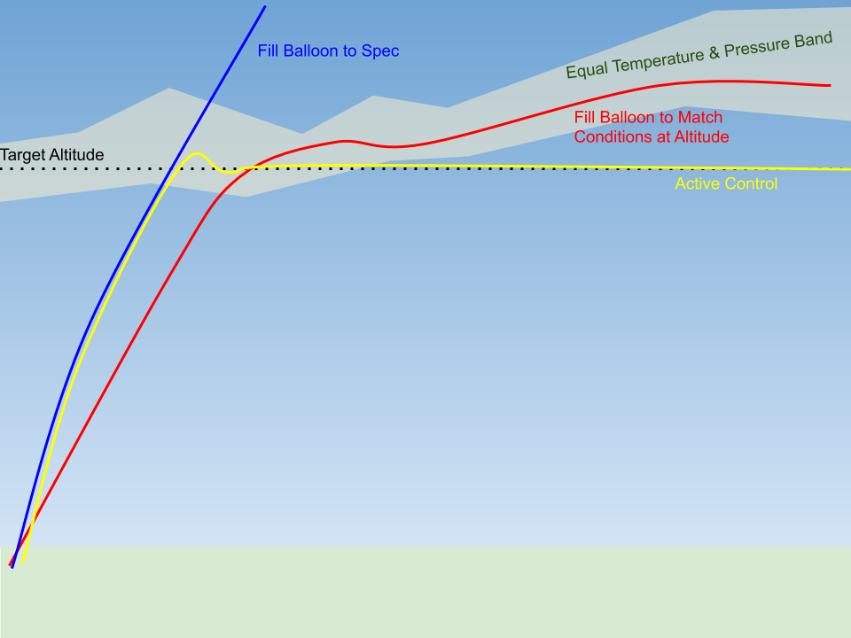
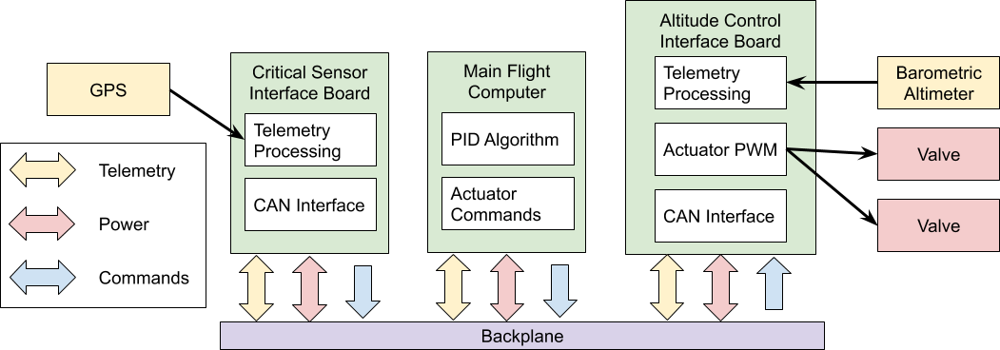

# Altitude Control Logic

Lead: Philip Linden

**Overview**: The scope of this PDR covers the logic and operations of the
altitude controller system on the HAB, including arm and disarm criteria,
approach for calculating when to actuate controllers, and risk mitigation
strategies. The design of actuation mechanisms and electronic components are
discussed in [Mechanical Systems](placeholder.md) and [Flight Avionics
Hardware](placeholder.md), respectively.

**Objective**: Actively control the weight and buoyancy of the HAB in order to
maintain equilibrium at a prescribed altitude.

## Approach
Normally the balloon is filled with lifting gas so that it rises with the
payload until it reaches an altitude where the ambient temperature and pressure
cause the balloon to expand beyond its limits and it bursts. Without active
control, flight time can be increased by filling the balloon with just enough
lift gas to be at equilibrium at the target altitude, but this is difficult for
several reasons:

- The actual temperature and pressure at the target altitude are at best
  roughly approximated by models, even when accounting for the latest weather
  forecast.
- Temperature and pressure are not constant at the target altitude, so even if
  there was a perfectly measured amount of lift gas to be at equilibrium for a
  specific temperature and pressure band, it wouldn’t follow a target altitude.
- Filling the balloon with less gas would mean it takes longer for the HAB to
  reach the target altitude.

The HAB’s altitude is a function of two opposing forces: the upward buoyancy
force and the weight of the balloon-payload system. Critically, both are
directly influenced by something we can control. Buoyancy is a function of the
amount of lift gas in the balloon, and weight is a function of the mass of the
payload. Thus we can design a closed-loop control algorithm to change the
balance of these two forces by bleeding lift gas from the balloon or dropping
ballast mass from the payload based on the measured altitude in order to
converge to some target altitude. This addresses a number of issues encountered
with passive flight:

- Dynamic feedback control allows the balloon to maintain equilibrium at a
  target altitude through changing temperatures and pressures.
- Open-loop control of lifting gas allows the balloon to be overfilled at
  launch, rising to the target altitude quickly and then bleeding gas from the
  balloon until equilibrium is achieved.

In order for the controller to converge to a geometric altitude, it must use a
non-atmospheric reference like GPS altitude. Barometric altimeters measure
pressure, which is calibrated to isobaric layers of a standard reference
atmosphere.

**Primary mode**: GPS altitude hold.   **Secondary mode**: Isobaric
altitude hold.

## Concept of Operations

1. Wait for a *controller enable* to be sent.
    1. Disarm the controller when the avionics boot up.
    2. During pre-launch, operators enable the controller.
2. Disarm the controller unless when all of the following conditions are met:
    1. A controller enable command has been received since the last boot or the
       last controller disable command.
    2. The control error has crossed zero at least once (i.e., the HAB’s
       altitude has risen above the target altitude at least once).
    3. There is ballast mass remaining in the reservoir.
        1. Calibrate the mass flow rate at the ballast release valve prior to
           flight and keep a tally of remaining ballast mass.
    4. There is enough lifting gas in the balloon for the HAB to rise if the
       reservoir were empty.
        1. Use a pressure sensor in the balloon to compute the mass flow rate
           at the bleed valve from the gauge pressure and temperature of
           lifting gas inside the balloon and keep a tally of remaining lifting
           gas.
3. Use a tuned PI control to drive a ballast release valve and a gas bleed
   valve. The controller is designed for disturbance rejection of a noisy
   altitude signal.
    1. In order to conserve control effort, we must tune the controller such
       that overshoot and oscillations are minimized.
    2. Response time and settling time should be tuned to be small compared to
       flight time, but can still be on the order of ~1 hour.
    3. Control loop PWM frequency is tuned to be much faster than the response
       time.
4. **GPS altitude hold (Stabilize):** Enter stabilize control mode when the
   controller is armed and remain in this mode until ascent rate and/or
   altitude error are greater than the allowable bounds.
    1. Use GPS altitude to converge to a geometric altitude that may cross
       isobaric layer boundaries.
    2. This control mode uses more control mass than barometric altitude hold
       so it should not be used for extended periods of time.
    3. Use this control mode during the stabilize phase to quickly approach the
       target altitude.
5. **Barometric altitude hold (Cruise):** Once the vehicle is near the target
   altitude and has reached a steady state, transition to cruise mode to
   maintain an altitude near the target for an extended period of time.
    1. Use barometric altitude to equalize to an isobaric layer of the
       atmosphere corresponding to a calibrated approximate altitude.
    2. This control mode uses less control mass because it is able to equalize
       the balloon pressure to ambient pressure and “ride” isobaric layers of
       atmosphere.
    3. Hold an isobaric altitude during the cruise phase in order to conserve
       control mass.
6. If the controller is still armed and the altitude error exceeds the
   allowable range, transition from cruise to stabilize and then repeat this
   algorithm until the controller is disarmed.
7. When the controller is disarmed, dump all remaining ballast.
    1. Lock the ballast valve in the open position.
    2. Lock the bleed valve in the closed position.

## PID Control
In order to dynamically determine how much to bleed or ballast, we implement a
PID controller to determine the percentage of time of each control cycle to
keep the bleed or ballast valve open. This is also referred to as PWM control
with a PID algorithm.

The PID control algorithm works by modulating the inputs, u, to the Plant,
which in our case means the bleed and ballast controls. The Plant is the
physical response, so the balance of weight, buoyancy, and drag forces with the
given mass properties and ambient conditions. (See
[1D Atmospheric Flight Model]([habtoolbox_1d-ascent-model.md](https://brickworks.github.io/HAB-toolbox/ascent_model/))) 
The output of the Plant is the actual altitude, *y*. For a given set point
altitude, *r*, the PID controller attempts to reduce the error, *e=r-y*, to 
zero.

The PID controller consists of a set of gains applied to a proportional term,
an integral term, and a derivative term that all operate on the error signal,
*e*. These gains are tuned to get the desired response from the controller.

### Rules of thumb

**Proportional gain**: How aggressively signal approaches setpoint. Too much
causes overshoot. No impact on steady-state error.

**Integral gain**: How much error matters over time. Reduces oscillations and
steady-state errors. Prone to windup, where accumulated errors over a long time
cause lag in the controller after it reaches the desired point.

**Derivative gain**: How much rate of change matters. Reduces overshoot. Prone
to oscillations. Noisy signals make it go crazy, but this can be mitigated by
adding a lowpass filter.

 

### References
- [BYU Dynamics and Control by John D. Hedengren](http://apmonitor.com/pdc/index.php/Main/ProportionalIntegralControl)
- [Control Tutorials for Matlab & Simulink](http://ctms.engin.umich.edu/CTMS/index.php?example=Introduction&section=ControlPID)
- [PID Control Design by A.B. Campo](https://www.intechopen.com/books/matlab-a-fundamental-tool-for-scientific-computing-and-engineering-applications-volume-1/pid-control-design)
- [Wikipedia - PID Controller, Wikipedia - Integral Windup](https://en.wikipedia.org/wiki/Integral_windup)
- [The Basics of Tuning PID Loops](https://www.crossco.com/blog/basics-tuning-pid-loops/)

### Tunable Parameters
To achieve the desired behavior from the controller, we tune some of the
parameters in software and tune other parameters as part of choosing or sizing
elements of the system during the design process.

#### Pure Tunables
I call the parameters that we can choose and change “for free” pure tunables,
since tuning these values can be done as desired without extra engineering
work.

- Target altitude
- Controller dead zone (allowable steady state error)
- Control loop cycle time (compute)
- Control loop cycle time (actuation PWM)
- Sensor measurement sample time
- Lowpass filter gain
- PID controller gains (which determine response time and percent overshoot)
- Initial ballast mass
- Initial lift gas mass
- Lift gas reserve fraction (fraction of total mass of lift gas allocated for
  altitude control)
- Arm / disarm criteria

#### Calibrated Tunables
*Calibrated* tunables are what I call parameters that affect the controller’s
behavior or system response but can’t be dialed in on a whim. These are things
that require extra engineering or design changes to tune. We choose ideal
values for these parameters during the design process, and then we measure the
true values when the system is built.

- Ballast mass flow rate
- Bleed mass flow rate
- Actuator and component dry mass
- Maximum control loop cycle time (compute)
- Maximum control loop cycle time (actuation PWM)
- Maximum sensor measurement sample time
- Maximum lift gas reserve fraction

## Avionics
The altitude control flight software application ([Main Flight Computer
Software Design](../pdr_avsw.md#main-flight-computer-software-design)) issues
commands to open the ballast or bleed valves over the CAN bus. When a bleed or
ballast command is received by the altitude control interface board
([Altitude Control/Dynamics Sensor Card](placeholder.md))
over CAN, it executes the corresponding subroutine to carry out the command.
The software environment onboard the altitude control interface board
([Altitude Control/Dynamics Card Software Design](pdr_avsw.md#avionics-sensor-card-software-design))
includes drivers for the hardware interfaces, such as a PWM motor controller
for the valve actuators.

The altitude control interface board is also responsible for polling sensors
and actuators for telemetry and pre-processing the raw signals (e.g. voltages
from a pressure sensor) into the appropriate derived values (e.g. values in
units of pressure) before sending them to the CAN bus for use by other flight
software and downlink.

### Sensing
- [Avionics Sensor Card](placeholder.md)
    - GPS altitude
    - Barometric altitude
    - Ambient pressure
- [Balloon Sensor Board](placeholder.md)
    - Balloon valve position/state
    - Balloon internal pressure
    - Remaining lift gas
- [Altitude Control/Dynamics Sensor Card](placeholder.md)
    - Ballast valve position/state
    - Remaining ballast sensor

### Actuation
- **Raise altitude:** Decrease total mass by releasing ballast. (See [Ballast Hopper](placeholder.md))
- **Lower altitude:** Decrease buoyancy by venting lift gas. (See [Balloon Plug](placeholder.md))

## System Design Parameters
### Requirements

| Requirement | Description | Target | Allowable Bounds |
| --- | --- | --- | --- |
| Settling time | Time for controller to transition from stabilize to cruise mode. | 20 minutes. | 10 minutes - 1 hour |
| Steady state error (dead zone) | Magnitude of the difference between target altitude and actual altitude during cruise mode | 150 m | 0 m - 500 m |
| Ballast mass budget | Portion of total system mass budget allocated to ballast material | 1 kg or 25% | 1 kg - 2 kg |
| Bleed mass budget | Portion of total system lift gas allocated to altitude control. | 0.5 kg or 30% | No more than the mass of lift gas needed for positive lift with empty ballast |
| Flight duration | Impact on total flight time (launch to recovery) with altitude control enabled compared to an equivalent flight with altitude control disabled | 7 hours | No less than the |modeled flight duration with controller disabled (upper bound constrained by geofencing and weather) |

### System Elements
| Configuration Item | Function | Location | Interfaces |
|---|---|---|---|
| Altitude Control Application | Executes control algorithm and issues commands to actuators. | [Main Flight Computer](pdr_avsw.md#main-flight-computer-software-design)) | [Main Flight Computer](pdr_avsw.md#main-flight-computer-software-design), [Telemetry RX App](pdr_avsw.md#can-tlm-rx), [Command TX App](placeholder.md) |
| [Altitude Control/Dynamics Sensor Card](placeholder.md) | Receives commands, drives bleed and ballast actuators, collects and preprocesses raw signals from sensors and reports telemetry to the CAN bus. | [Avionics Rack](placeholder.md) | [Avionics Rack](placeholder.md), [Backplane Interface Board](placeholder.md), [CAN bus TX/RX](pdr_avsw.md#can-tlm-rx) |
| [Ballast Valve Actuator](placeholder.md) | Dispenses ballast mass from the ballast hopper. | [Ballast Hopper](placeholder.md) | [Ballast Hopper](placeholder.md), [Altitude Control/Dynamics Sensor Card](placeholder.md) |
| [Bleed Valve Actuator](placeholder.md) | Vents lift gas from the balloon. | [Balloon Plug](placeholder.md) | [Balloon Plug](placeholder.md), [Balloon Board](placeholder.md) |
| Barometer | Measures ambient barometric pressure and is calibrated to provide approximate altitude based on standard altitudes of isobaric layers of the atmosphere. | [Avionics Sensor Card](placeholder.md) | [Avionics Sensor Card](placeholder.md) |
| GPS receiver | Measures GPS altitude. | [Avionics Sensor Card](placeholder.md) | [Avionics Sensor Card](placeholder.md) |

## Risk Assessment
| Risk | Impact | Mitigation |
|---|---|---|
| Controller bleeds too much gas and the remaining gas in the balloon cannot lift the payload, even with an empty ballast hopper. | **Severe.** Flight terminated early. | Calibrate the bleed valve mass flow rate perhaps in correlation to balloon internal pressure and/or time spent with the valve open.    Software disarm based on estimated lift gas remaining. |
| Altitude never converges to a stable altitude by the time actuation limits are reached. | **Minor.** Flight duration mission objective is compromised, but no impact to other impacts of the flight. | Tune the controller to minimize overshoot and oscillations, allowing for a longer response time. |
| Bleed valve releases more gas than estimations or measurements report. | **Moderate.** It's okay if more gas is released than expected unless the remaining gas in the system cannot lift the "dry" mass of the system. | Add some margin to the lift gas reserve level so that the controller is disarmed due to low gas before reaching a dangerously low level.    Make a direct measurement from inside the balloon that correlates to the amount of gas remaining, such as a calibrated temperature and pressure corresponding to the amount of gas remaining. |
| Bleed valve gets stuck in the open position. | **Severe.** Flight terminated early. | Add a redundant/emergency valve close mechanism to the balloon plug.    Build a cutdown threshold into the altitude controller so that if the controller is armed and altitude reaches the lower bound, the flight is terminated via cutdown. |
| Bleed valve gets stuck in the closed position. | **Minor.** Altitude control is critically disabled, but no impact to other impacts of the flight. | Testing and pre-flight inspection. |
| Ballast valve releases more ballast than estimations or measurements report. | **Moderate.** It’s okay if more ballast is released than expected unless the controller thinks there is more ballast to release but there is not. | Add some margin to the ballast reserve level so that the controller disarms due to ballast before reaching a dangerously low level.    Make a direct measurement from inside the ballast hopper correlated to the amount of ballast remaining, such as a calibrated mass flow rate corresponded to ballast remaining. |
| Ballast valve gets stuck in the open position. | **Minor.** Altitude control is critically disabled, but no impact to other impacts of the flight. | Testing and pre-flight inspection. |
| Ballast valve gets stuck in the closed position. | **Moderate.** If ballast is stuck closed and the vehicle is descending, this would terminate the flight as the vehicle would not be able to recover positive lift. | Redundant valve open mechanism or emergency (forcible) dumping of all ballast.    Store additional dry mass to release as emergency ballast. |
| Controller is armed too early. | **Moderate.** Bleed and ballast reserves could be expended prior to reaching the target altitude or meeting the flight duration target. | Place conservative delays and lockouts on the arming criteria. |
| Altitude measurements are noisy or inaccurate. | **Moderate.** Bleed and ballast reserves could be expended prior to reaching the target altitude or meeting the flight duration target. | Use a low-pass filter on sensor readings, introduce a dead zone to the controller activation scheme, and fuse altitude readings from multiple sensors. |
| Drastic transient changes to ascent rate and altitude due to localized atmospheric wind shear. | **Moderate.** A localized area of the atmosphere could cause us to releast a lot of gas/ballast to compensate, then dump us back where we started, causing a lot of control mass to be wasted. | Look at local GFS weather data on launch day. If there is significant vertical wind shear in the area, stand down on launch.    For significant and sudden changes in ascent rate (or other measurement data like pressure, acceleration, etc), especially during cruise mode, temporarily disarm the altitude controller. |

## Schedule

## Proof of Concept

A PID controller of this nature has been demonstrated using MATLAB/Simulink
integrated with an implementation of a
[1D Simple Atmospheric Ascent Model](https://brickworks.github.io/HAB-toolbox/ascent_model/).

The model [source code is available on GitHub](https://github.com/Brickworks/HAB-toolbox/tree/master/etc/Simulink)
along with a [PDF version of the schematic](etc/simulink_ascent_model_variable_mass_displayorganization.pdf).

